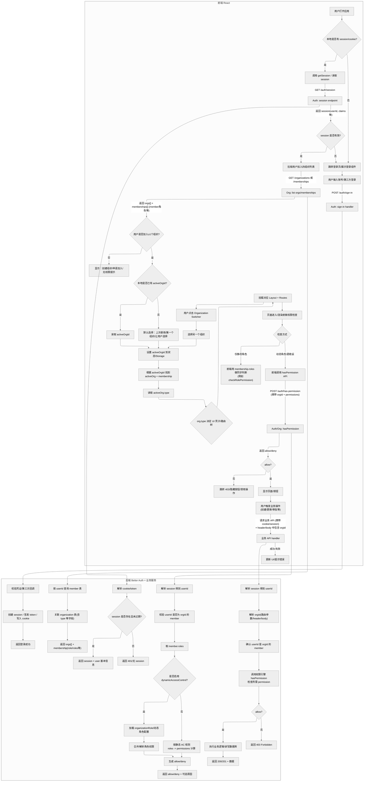

## Better-Auth认证流程

```mermaid
---
config:
  layout: elk
  theme: neutral
---
flowchart TB
 subgraph FE["前端 React"]
        A1{"本地是否有 session/cookie?"}
        A0["用户打开应用"]
        L1["跳转登录页/展示登录组件"]
        L2["用户输入账号/第三方登录"]
        B1["Auth: sign-in handler"]
        A2["调用 getSession / 读取 session"]
        B2["Auth: session endpoint"]
        A3{"session 是否有效?"}
        A4["拉取用户加入的组织列表"]
        B3["Org: list orgs/memberships"]
        A5{"用户是否加入≥1个组织?"}
        A6["显示：创建组织/申请加入/无权限提示"]
        A7{"本地是否已有 activeOrgId?"}
        A8["默认选择：上次使用/第一个组织/让用户选择"]
        A9["读取 activeOrgId"]
        A10["设置 activeOrgId 到状态/Storage"]
        A11["根据 activeOrgId 找到 activeOrg + membership"]
        A12["读取 activeOrg.type"]
        A13{"org.type 决定 UI 壳子/路由树"}
        A14["挂载对应 Layout + Routes"]
        R1["页面进入/渲染前做权限检查"]
        R2{"检查方式"}
        R3["前端用 membership.roles 做同步判断<br>(例如 checkRolePermission)"]
        R4["前端调用 hasPermission API"]
        B6["Auth/Org: hasPermission"]
        R5{"allow?"}
        R6["跳转 403/隐藏按钮/禁用操作"]
        R7["显示页面/按钮"]
        S1["用户点击 Organization Switcher"]
        S2["选择另一个组织"]
        X1["用户触发业务操作<br>(创建/更新/审批等)"]
        B7["业务 API handler"]
        X2["更新 UI/提示错误"]
  end
 subgraph BE["后端 Better Auth + 业务服务"]
        B1a["校验凭证/第三方回调"]
        B1b["创建 session / 签发 token / 写入 cookie"]
        B1c["返回登录成功"]
        B2a["解析 cookie/token"]
        B2b{"session 是否存在且未过期?"}
        B2c["返回 401/无 session"]
        B2d["返回 session + user 基本信息"]
        B3a["按 userId 查询 member 表"]
        B3b["关联 organization 表(含 type 等字段)"]
        B3c["返回 orgs[] + membership(role/roles等)"]
        B6a["解析 session 得到 userId"]
        B6b["校验 userId 是否为 orgId 的 member"]
        B6c["取 member.roles"]
        B6d{"是否启用 dynamicAccessControl?"}
        B6e["按静态 AC 规则<br>roles -&gt; permissions 计算"]
        B6f["加载 organizationRole/动态角色配置"]
        B6g["合并/解析角色权限"]
        B6h["生成 allow/deny"]
        B6i["返回 allow/deny + 可选原因"]
        B7a["解析 session 得到 userId"]
        B7b["解析 orgId(路由参数/header/body)"]
        B7c["确认 userId 是 orgId 的 member"]
        B7d["调用权限引擎 hasPermission<br>检查所需 permission"]
        B7e{"allow?"}
        B7f["返回 403 Forbidden"]
        B7g["执行业务逻辑/读写数据库"]
        B7h["返回 200/201 + 数据"]
  end
    A0 --> A1
    A1 -- 否 --> L1
    L1 --> L2
    L2 -- "POST /auth/sign-in" --> B1
    A1 -- 是 --> A2
    A2 -- GET /auth/session --> B2
    B2 -- 返回 session(userId, claims等) --> A3
    A3 -- 否 --> L1
    A3 -- 是 --> A4
    A4 -- GET /organizations 或 /memberships --> B3
    B3 -- 返回 orgs[] + memberships[] (member角色等) --> A5
    A5 -- 否 --> A6
    A5 -- 是 --> A7
    A7 -- 否 --> A8
    A7 -- 是 --> A9
    A8 --> A10
    A9 --> A10
    A10 --> A11
    A11 --> A12
    A12 --> A13
    A13 --> A14
    A14 --> R1 & S1
    R1 --> R2
    R2 -- 仅静态角色 --> R3
    R2 -- 动态角色/更稳妥 --> R4
    R4 -- "POST /auth/has-permission<br>(携带 orgId + permissions)" --> B6
    B6 -- 返回 allow/deny --> R5
    R5 -- 否 --> R6
    R5 -- 是 --> R7
    S1 --> S2
    S2 --> A10
    R7 --> X1
    X1 -- 请求业务 API (携带 cookie/session)<br>+ header/body 中包含 orgId --> B7
    B7 -- 成功/失败 --> X2
    B1 --> B1a
    B1a --> B1b
    B1b --> B1c
    B2 --> B2a
    B2a --> B2b
    B2b -- 否 --> B2c
    B2b -- 是 --> B2d
    B3 --> B3a
    B3a --> B3b
    B3b --> B3c
    B6 --> B6a
    B6a --> B6b
    B6b --> B6c
    B6c --> B6d
    B6d -- 否 --> B6e
    B6d -- 是 --> B6f
    B6f --> B6g
    B6e --> B6h
    B6g --> B6h
    B6h --> B6i
    B7 --> B7a
    B7a --> B7b
    B7b --> B7c
    B7c --> B7d
    B7d --> B7e
    B7e -- 否 --> B7f
    B7e -- 是 --> B7g
    B7g --> B7h
```
